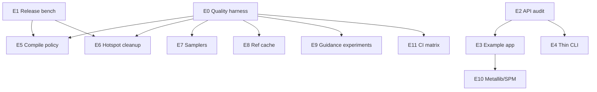

# Flux2Kit Next Evolution Plan

**Decisions locked in**
- **Identity:** Library-first. `Flux2Kit` is the product; `flux2kit-cli` is a thin demo / feature harness for major features and easy testing.
- **Parity:** Drop the hard pixel-exact lock against `scf4/mlx-flux2`. The Python reference remains a useful baseline and regression source, not a ceiling. Proven quality/perf improvements are in scope when a harness can measure them.

**North star:** Make `Flux2Kit` the best embeddable on-device FLUX.2 [klein] library for Apple Silicon apps — clean API, predictable memory, measurable quality, and a CLI that exists to prove and demo the library.

---

## 6.1 Current State (post M1–M12)

### Strengths
- End-to-end generation and editing work on real weights
- Staged residency (TE → transformer → VAE), quantization, tiling
- `GenerationOptions`, `Sampler`, `resizeHighQuality`, compile path wired
- 41 unit tests + manual CLI verification under [`dev/test/`](test/)

### Gaps blocking the next leap
- No automated **image quality / regression harness** — golden tests cover tokenizer + ops, not pixels
- Public API is wide and uneven (many low-level weight/sampling helpers are `public`)
- `--compile` is opt-in and not pixel-identical to eager; no release-build performance baseline
- Example app is minimal; no SPM-consumer docs beyond a short README snippet
- Deferred quality work (KV-cache, guidance schedules, more samplers) was blocked by the old parity contract — now unblocked
- CLI still carries some library parsing helpers (`CLIParsing.swift` lives in the library target)

---

## 6.2 Development Board

### Phase 0 — Contract & measurement foundation
**Goal:** Replace the old parity lock with a measurable quality bar so every later change can ship with evidence.

#### E0 — Quality regression harness
**Severity:** Critical  
**Affected:** `Tests/Flux2KitTests/`, `Tests/Flux2KitTests/Fixtures/`, CI, `Scripts/`

**Required changes:**
- Define a small fixed suite: prompt + seed + size + steps + guidance → expected output (or stats)
- Metrics: mean abs pixel diff, max diff, optional LPIPS later; store goldens as PNG under Fixtures
- Modes:
  - `strict` — fail if mean diff > 0.5/255 (determinism / Euler default)
  - `soft` — fail if mean diff > 5/255 (compile / Heun / experimental paths)
- Gate behind `FLUX2_RUN_IMAGE_TESTS=1` (needs weights + metallib); keep default `swift test` green
- Script: `Scripts/refresh_goldens.sh` to regenerate goldens intentionally
- Comment: `// PERMANENT — quality harness replaces hard Python parity lock`

**Acceptance:**
- Re-running Euler default with same seed is mean-diff ≈ 0 vs its golden
- Breaking a known weight conversion (e.g. undo norm_out swap) fails the harness
- CI runs CPU/unit tests always; image tests opt-in or on a labeled runner

#### E1 — Release-build performance baseline
**Severity:** High  
**Affected:** `Scripts/`, `dev/bench/`, README

**Required changes:**
- `Scripts/bench.sh` — release build, fixed prompt/seed/size, report per-stage ms for eager vs `--compile` vs Heun
- Write results to `dev/bench/BASELINE.md`
- Document recommended defaults for library consumers (keepResident vs unloadAfterUse, compile)

**Acceptance:**
- One command produces a comparable table on the same machine
- README links to the baseline and states “debug ≠ release”

---

### Phase 1 — Library productization
**Goal:** Make SPM consumption the happy path; CLI stays thin.

#### E2 — Public API surface audit
**Severity:** High  
**Affected:** `Sources/Flux2Kit/**`, `Package.swift`

**Required changes:**
- Split into intentional layers:
  - **Public product API:** `Flux2Pipeline`, `GenerationOptions`, editing entry points, `ImageOp` / `applyImageOps`, `loadImages` / `saveImage` / `resizeHighQuality`, `ResidencyPolicy`, `Sampler`, errors
  - **Internal / `package`:** weight conversion, denoise internals, shard resolution, `CLIParsing` (move to CLI target or mark package-private)
- Prefer `package` access (Swift 5.9+) over accidental `public` for internals
- Add `Docs/Library.md` (or DocC overview): init → generate → unload policies → threading notes
- Comment: `// PERMANENT — library-first API boundary`

**Acceptance:**
- Example app still builds against the public surface only
- CLI still builds; no behavior change required in this milestone

#### E3 — First-class SPM example & ergonomics
**Severity:** Medium  
**Affected:** `Examples/Flux2KitExample/`, `GenerationOptions`, pipeline init

**Required changes:**
- Expand example: t2i, img2img, one edit path, model-free ops, compile + residency knobs
- Ensure `GenerationOptions` covers sampler/compile (or pipeline-level compile) consistently
- Async-friendly docs: who holds the lock, when to unload, Sendable guidance for CGImage
- Optional: progress callback on `generate` (step index / total) for app UI — library API, CLI can print it

**Acceptance:**
- New developer can generate an image from the example without reading CLI source
- Progress callback fires once per denoise step when provided

#### E4 — Thin CLI as demo harness
**Severity:** Medium  
**Affected:** `Sources/Flux2KitCLI/CLIMain.swift`, `CLIParsing.swift`

**Required changes:**
- Move CLI-only parsers into the CLI target (or keep shared parsers as `package` if tests need them)
- Structure CLI around library calls only — no duplicated pipeline logic
- Document CLI as “demo & feature lab” in README (already started)
- Keep CLI flags for major library features only: compile, sampler, residency, upscale, quality, seeds

**Acceptance:**
- Adding a library feature has a clear “wire one flag” path in CLI
- No new business logic lives only in the CLI

---

### Phase 2 — Performance (now unshackled)
**Goal:** Make the fast path the recommended path when the harness says quality is acceptable.

#### E5 — Compile policy
**Severity:** High  
**Affected:** `Flux2Pipeline.swift`, CLI, harness

**Required changes:**
- Use E0 soft threshold to decide default: if compile vs Euler mean-diff < 5/255 on the golden set, document `compile: true` as recommended for apps
- Keep `compile: false` available for bit-stable research / golden refresh
- Fix nil-placeholder issues in compiled closures if any remain (distilled vs CFG paths)
- Optionally compile VAE decode when not tiled
- Comment: `// PERMANENT — compile is a first-class performance path, quality-gated by harness`

**Acceptance:**
- Soft harness passes for compile on the golden set
- Bench shows clear warm-run win vs eager in release

#### E6 — Denoise & host-sync hotspots
**Severity:** Medium  
**Affected:** `Sampling.swift`

**Required changes (quality-gated):**
- Reduce remaining host-device syncs (`compressTime`, unnecessary `eval`)
- Vectorize `batchedPrcImg` / `batchedPrcTxt` where safe
- Measure with E1 before/after; soft harness must stay green

**Acceptance:**
- Measurable denoise or prep speedup in release bench
- Soft harness still passes

---

### Phase 3 — Quality & capabilities (reference is a baseline, not a ceiling)
**Goal:** Ship improvements the old parity lock blocked.

#### E7 — Sampler suite expansion
**Severity:** Medium  
**Affected:** `Sampling.swift`, `GenerationOptions`, CLI

**Required changes:**
- Keep Euler as deterministic default for goldens
- Harden Heun (already shipped); consider DPM++ 2M or another low-step-friendly method if it beats Heun on the soft harness at 4 steps
- Document recommended sampler × step recipes for klein distilled

**Acceptance:**
- Soft harness + subjective note in `dev/bench` or RESULTS for 4-step Heun/DPM vs Euler

#### E8 — Reference-image performance (KV / caching research)
**Severity:** Low–Medium  
**Affected:** `Sampling.swift`, `Flux2Pipeline.swift`, kontext path

**Required changes:**
- Prototype caching of reference-image PE / embeddings across steps if the architecture allows
- No Python baseline required — validate with wall-clock + soft harness (output must not degrade vs uncached)
- Ship only if speedup ≥ 10% on multi-ref workloads and soft harness passes

**Acceptance:**
- Documented go/no-go with numbers; merge only on go

#### E9 — Guidance & schedule experiments
**Severity:** Low  
**Affected:** `Sampling.swift`, pipeline

**Required changes:**
- Optional guidance schedule / step-dependent guidance for non-distilled / CFG path
- Distilled path stays simple (guidance embed) unless harness shows a win
- All experiments behind explicit options; defaults remain the known-good klein recipe (4 steps, guidance 1.0)

**Acceptance:**
- Default path unchanged; experimental flags documented as such

---

### Phase 4 — Platform & packaging polish
**Goal:** Reduce friction for real app adoption.

#### E10 — Metallib & dependency story
**Severity:** Medium  
**Affected:** `Scripts/setup_metallib.sh`, `Package.swift`, README

**Required changes:**
- Document/automate metallib for SPM consumers (not only this repo’s CLI)
- Revisit pinned mlx-swift / swift-transformers revisions with harness + bench as gate
- Clarify minimum OS / Xcode in Library.md

**Acceptance:**
- Fresh clone → example t2i path documented in ≤5 commands

#### E11 — CI matrix
**Severity:** Medium  
**Affected:** `.github/workflows/swift.yml`

**Required changes:**
- Always: unit + parser tests
- Optional/nightly: image harness when secrets/weights available (or skip cleanly)
- Fail PRs that change weight conversion without updating goldens intentionally

**Acceptance:**
- PR CI green without weights; image job documented as optional

---

## Implementation Order

1. **E0** Quality harness — unblocks everything  
2. **E1** Release bench — truth for perf claims  
3. **E2** API surface audit — library-first identity  
4. **E3** Example + ergonomics  
5. **E5** Compile policy (depends on E0 + E1)  
6. **E4** Thin CLI  
7. **E6** Hotspot cleanup  
8. **E7–E9** Quality/capability experiments  
9. **E10–E11** Packaging & CI  

---

## Explicitly out of scope (for now)

- Multi-model zoo (SDXL, other FLUX sizes) — focus on klein-4B excellence first  
- iOS deployment — macOS library first; revisit after E2/E10  
- ComfyUI feature parity race — keep nodes wrapping CLI; don’t build a node ecosystem  
- Guaranteeing pixel-exact match to Python forever  

---

## Success criteria for this evolution

| Signal | Target |
|--------|--------|
| Library identity | New consumers start from Example + Library.md, not CLIMain |
| Measurement | Image harness + release bench exist and are used before merging perf/quality PRs |
| Performance | Documented recommended path (likely compile + keepResident for apps) with numbers |
| Quality | At least one post-reference improvement ships with soft-harness evidence |
| CLI | Remains thin; every major flag maps 1:1 to a library option |

---

## Immediate next step

Start **E0 (quality regression harness)** — it is the foundation that makes dropping the hard parity lock safe rather than reckless.
